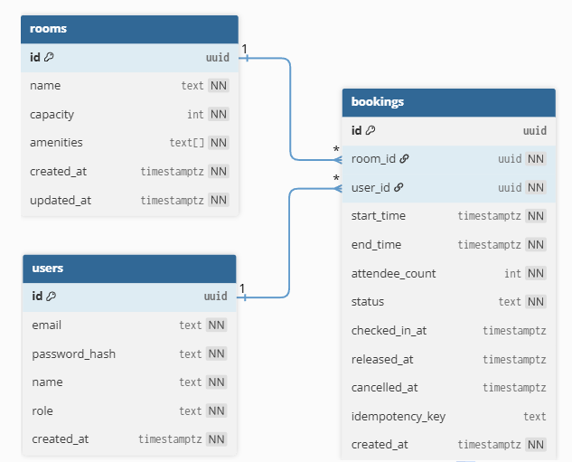

# Database

Atrium's schema is small: three tables, `users`, `rooms`, and `bookings`. Most of it is conventional. The parts that are not conventional are where the business rules live, because this design pushes as much correctness as it can into the database rather than trusting application code to remember. This page covers the tables, the constraints that enforce the rules, the indexes, and how time is represented. The single most important constraint has its own page; see [Concurrency](concurrency.md).

<p align="center">
  
</p>

## Extensions

The initial migration enables two extensions:

- `pgcrypto`, for `gen_random_uuid()`. It lives in core from Postgres 13 onward but in `pgcrypto` on 12 and earlier, so requesting it explicitly keeps the migration portable across the Compose image and whatever managed Postgres a deployment uses.
- `btree_gist`, which lets a GiST index carry a scalar (`room_id`, compared with `=`) alongside a range (compared with `&&`). Without it the overlap constraint cannot be created at all, because GiST has no native equality operator class for `uuid`.

## users

```sql
CREATE TABLE users (
    id            uuid        PRIMARY KEY DEFAULT gen_random_uuid(),
    email         text        NOT NULL,
    password_hash text        NOT NULL,
    name          text        NOT NULL,
    role          text        NOT NULL DEFAULT 'member',
    created_at    timestamptz NOT NULL DEFAULT now(),
    ...
);
```

Two decisions worth calling out:

- **Email uniqueness is case-insensitive, enforced in the index.** A unique index on `lower(email)` means `Ada@x.com` and `ada@x.com` are the same account. Enforcing it in the index rather than by lowercasing in application code means it holds no matter which code path does the insert.
- **Role is a checked text column, not an enum.** It is constrained to `member` or `admin`. Anyone who registers is a member; admins are promoted directly in the database, because self-service admin signup is not something a real space would want. Passwords are hashed with argon2id (a memory-hard algorithm with a per-hash salt) in the `auth` package before they ever reach this table.

## rooms

```sql
CREATE TABLE rooms (
    id         uuid        PRIMARY KEY DEFAULT gen_random_uuid(),
    name       text        NOT NULL,
    capacity   int         NOT NULL,
    amenities  text[]      NOT NULL DEFAULT '{}',
    ...
);
```

**Amenities are a `text[]`, not a join table.** At this scale amenities are a tag set: never queried on their own, only ever filtered as "room has all of these." A GIN index on the array makes that containment query (`@>`) fast, and it avoids two extra tables and a join for data that has no independent identity. If amenities ever grew their own attributes (an icon, a description, a per-room quantity) a normalized table would win. They have not, so the array stays. This is a case where the simpler structure is the correct one, not a shortcut.

**Capacity is advisory.** A room with capacity 8 will still accept a booking for 10 attendees; the number is shown to help people choose a room, and the check is a friendly validation rather than a hard block. Room names are unique case-insensitively, the same way emails are.

## bookings

This is where the design concentrates. The columns are ordinary; the constraints are the point.

```sql
CREATE TABLE bookings (
    id             uuid        PRIMARY KEY DEFAULT gen_random_uuid(),
    room_id        uuid        NOT NULL REFERENCES rooms (id) ON DELETE RESTRICT,
    user_id        uuid        NOT NULL REFERENCES users (id) ON DELETE CASCADE,
    start_time     timestamptz NOT NULL,
    end_time       timestamptz NOT NULL,
    attendee_count int         NOT NULL DEFAULT 1,
    status         text        NOT NULL DEFAULT 'confirmed',
    checked_in_at  timestamptz,
    released_at    timestamptz,
    cancelled_at   timestamptz,
    idempotency_key text,
    created_at     timestamptz NOT NULL DEFAULT now(),
    ...
);
```

### The overlap constraint

The reason this schema exists is the exclusion constraint `bookings_no_overlap`, which makes two overlapping confirmed bookings for one room impossible at the database level. It is covered in full on the [Concurrency](concurrency.md) page rather than repeated here, because it deserves the space. The short version:

```sql
ALTER TABLE bookings
    ADD CONSTRAINT bookings_no_overlap
    EXCLUDE USING gist (
        room_id WITH =,
        tstzrange(start_time, end_time, '[)') WITH &&
    )
    WHERE (status = 'confirmed');
```

The `'[)'` bounds and the `WHERE status = 'confirmed'` predicate are both load-bearing, and both are explained on the concurrency page.

### The other constraints

Everything else on the table is a `CHECK` that stops an impossible row from ever being written, even if a future code path forgets to enforce the same rule:

| Constraint | What it guarantees |
|---|---|
| `bookings_status_valid` | Status is one of `confirmed`, `cancelled`, `released`. |
| `bookings_end_after_start` | The end time is strictly after the start time. |
| `bookings_duration_within_bounds` | A booking runs between 15 minutes and 8 hours. |
| `bookings_attendee_count_positive` | At least one attendee. |
| `bookings_cancelled_at_matches_status` | A row is cancelled if and only if `cancelled_at` is set. |
| `bookings_released_at_matches_status` | A row is released if and only if `released_at` is set. |
| `bookings_released_implies_no_checkin` | A released booking never has a check-in, because release is by definition what happens when nobody turns up. |

The status-and-timestamp checks are the interesting ones. They make the timestamp columns agree with the status they describe, so an inconsistent row (a `cancelled` booking with no `cancelled_at`, or a `released` booking that somehow also has a check-in) cannot exist at all. The database refuses it regardless of what the application does.

The duration bounds are the one rule mirrored in two places: here in SQL and in the Go constants in `config/config.go`. The database is the real enforcement point; the Go constant exists only so the API can return a helpful "meetings can run at most 8 hours" instead of surfacing a raw constraint name. [Configuration](configuration.md#booking-policy-constants) explains which policy values are enforced where.

### Room deletion is restricted, not cascading

`room_id` references `rooms` with `ON DELETE RESTRICT`, deliberately, not `CASCADE`. Deleting a room should not silently erase the bookings people are relying on. The admin delete path checks for future confirmed bookings and returns a 409 listing them; the `RESTRICT` is the backstop if anything ever tries to bypass that check. By contrast `user_id` cascades, because deleting a user genuinely should remove their bookings.

## Indexes

The indexes exist to serve the three queries the app actually runs:

| Index | Serves |
|---|---|
| `bookings_room_time_idx` (partial, `WHERE status = 'confirmed'`) | Availability queries, which always filter to confirmed bookings for a room in a time window. Cancelled and released rows are dead weight for reads and are excluded. |
| `bookings_user_start_idx` | "My bookings," newest first. |
| `bookings_user_idempotency_key` (unique, partial) | Idempotency-key replay detection, scoped per user so two users cannot collide on the same client-generated key. Partial because the column is null for requests that did not send the header. |
| `rooms_amenities_idx` (GIN) | The "has all of these amenities" filter. |

The partial index on confirmed bookings is the same predicate the overlap constraint uses, which is not a coincidence: flipping a booking to `released` drops it out of both at once, which is exactly what makes lazy no-show release work.

## Time representation

All `timestamptz` columns store UTC. The one accepted input form is RFC 3339 with an explicit offset. A naive `2026-01-02T09:00` is rejected rather than guessed at, because getting the zone wrong by an hour is the single most common booking bug there is. The client knows the viewer's zone and converts before asking. The request parser (`http/params.go:timeVal`) is where that rejection happens.

Bookings use half-open intervals, `[start, end)`. A booking ending at 11:00 and one starting at 11:00 do not overlap, so back-to-back reservations are legal. That convention runs consistently through the overlap constraint's `tstzrange(..., '[)')`, the availability filters, the `service/interval.go` helpers, and the `from`/`to` filters on the list endpoints. Closed-range overlap logic would get this wrong and reject legal back-to-back bookings.

## Migrations

Migrations are plain SQL files in `backend/migrations/`, named `NNN_description.up.sql` and `NNN_description.down.sql`. They are applied by the `migrate` tool, which the Compose stack runs as its own step before the API starts.

To add one:

1. Create the `up` and `down` pair with the next number.
2. Apply it locally with `docker compose down -v && docker compose up`, which recreates the database and runs every migration from scratch.
3. The integration tests apply migrations automatically, so a new migration is exercised the next time you run them against a real database. See [Testing](testing.md).

In production the API image is distroless and has no migrate tool, so migrations run from your machine against the database's external URL. [Deployment](deployment.md#migrations) has the exact command.
